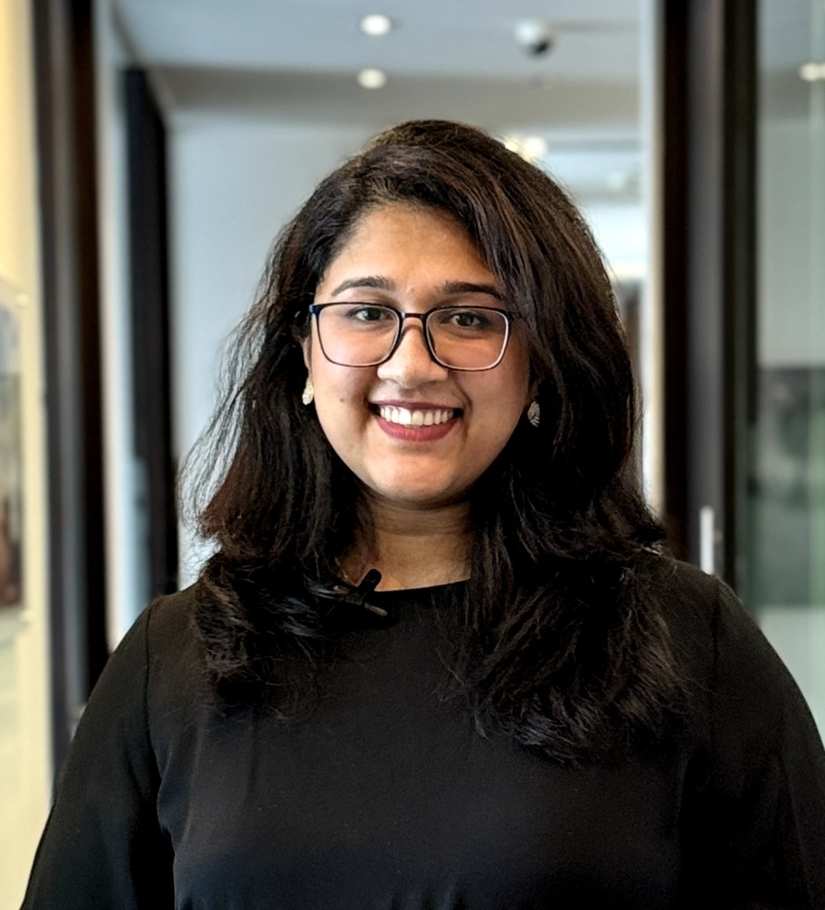

<table>
  <tr>
    <td width="190" valign="middle">
      
    </td>
    <td valign="middle">
      <h1>Chris Dona</h1>
      <h3>Marketing Manager | Senior Digital Marketing Manager</h3>
      
<strong>Marketing Strategy + Hands-on Execution</strong>

    </td>
  </tr>
</table>

  
  
  
  

  
  
  

---

## Profile

Marketing Manager and Marketing Strategist with **15+ years of total professional experience**, including **10+ years of UAE digital marketing experience**, combining **strategic marketing leadership with strong hands-on digital marketing knowledge and execution capability**.

Experienced in developing and leading end-to-end marketing strategies across **Digital & Performance Marketing, SEO, AEO/GEO, Paid Media, Lead Generation, Analytics, CRM, Content Strategy, Social Media, Website Strategy, Conversion Optimisation, Events and PR**.

My experience spans both **strategic management and practical execution**, enabling me to set direction, manage teams and external partners, evaluate creative and campaign output, analyse performance and step into execution where required.

Worked across **Corporate Services, Business Setup, Immigration, Legal, Real Estate, Automotive, E-Commerce, Healthcare, Professional Services, Logistics, Beauty and Luxury Lifestyle**, supporting brands across Dubai, London and international markets.

> [!IMPORTANT]
> **Positioning:** Marketing leadership supported by deep hands-on digital experience, allowing me to manage strategy, teams, agencies, campaigns and performance while remaining close to execution.

---

## 📈 Portfolio Snapshot

|                               |                                  |                                     |
| :---------------------------: | :------------------------------: | :---------------------------------: |
|         **15+ Years**         |           **10+ Years**          |            **AED 110K+**            |
| Total Professional Experience | UAE Digital Marketing Experience | Monthly Marketing Budget Experience |

---

## 📄 CV / Resume

For a complete overview of my professional experience, leadership responsibilities, marketing expertise and career history:

## 💼 Career at a Glance

| Period             | Organisation                                 | Role                                                           |
| ------------------ | -------------------------------------------- | -------------------------------------------------------------- |
| **2024 – Present** | LFL International Group, LF Legal & Madam Me | **Marketing Manager**                                          |
| **2022 – 2023**    | ADAM Global CSP & Dubai Business Advisors    | **Performance Marketing Manager**                              |
| **2018 – 2022**    | Vibrand 360, Kickstart Me & Upcreative       | **Marketing Strategist / Senior Digital Marketing Consultant** |
| **2016 – 2018**    | Al Wafaa Group                               | **Digital Marketing Team Lead**                                |
| **2011 – 2015**    | Cognizant Technology Solutions               | **Software Analyst / Data Analyst**                            |

My career combines **marketing strategy, digital execution, leadership, analytics and technology**, enabling me to approach marketing from both commercial and technical perspectives.

---

# 📁 General Digital Marketing & Growth Portfolio

A consolidated portfolio showcasing experience across **performance marketing, SEO, lead generation, social media, e-commerce, analytics, website development, content marketing and multi-brand growth strategy**.

Includes selected work across **ADAM Global, LFL International Group, LF Legal, Madam Me, Collective Hair & Beauty, Vibrand 360 / Upcreative clients and Al Hajis Perfumes**.

---

# 📊 Featured Digital Marketing Case Studies

## ADAM Global | Dubai, UAE

Managed and scaled ADAM Global's full-funnel marketing ecosystem across **SEO, Google Ads, Meta Ads, remarketing, social media, content marketing, local search, analytics, events and Salesforce lead generation**.

### Key Results

| Metric                                     |              Result |
| ------------------------------------------ | ------------------: |
| Monthly Digital Budget Experience          | **Up to AED 110K+** |
| Salesforce Leads, Reported Analytics Month |           **1,323** |
| Social Audience During Management          |          **~44.5K** |
| Priority Keywords in Google Top 10         |              **55** |
| Keywords Ranked #1                         |              **21** |
| Top 20 Company-Setup Pages                 |  **4,756 sessions** |
| New Users from Top 20 Pages                |           **3,965** |

<strong>View Strategy & Contributions</strong>

 

* Developed and managed multi-channel marketing strategy across SEO, Google Ads, Meta Ads and remarketing
* Managed performance, targeting, audience segmentation and optimisation
* Built ADAM Global's social presence during my management period to approximately:

  * Instagram: **~18K followers**
  * Facebook: **~17.5K followers**
  * LinkedIn: **~9K followers**
* The same profiles subsequently grew to approximately **57.5K combined platform followers**
* Built visibility for high-commercial-intent searches around:

  * Dubai business consultancy
  * Company formation
  * Holding companies
  * Business licensing
  * Clinics
  * Sector-specific business setup
* Developed and managed SEO and content strategy
* Conducted technical and on-page SEO optimisation
* Managed backlink acquisition, guest posting and digital authority initiatives
* Developed conversion journeys using:

  * Cost Calculator
  * Landing pages
  * Enquiry forms
  * WhatsApp
  * Live chat
  * Salesforce CRM
* Managed international targeting across UAE, GCC, India, Pakistan, UK, US, Canada, Australia and European markets
* Strengthened Google Business Profile and local-search visibility
* Managed and supported business forums, networking events and client-engagement campaigns

---

## LFL International Group | Dubai, UAE

Built and developed LFL International Group's digital presence from an early-stage online footprint, creating a measurable acquisition ecosystem across **SEO, paid media, content marketing, website strategy, analytics and emerging AI-discovery channels**.

### Key Results

| Metric                  |                                    Result |
| ----------------------- | ----------------------------------------: |
| GA4 Sessions            |                                **30,000** |
| Active Users            |                                **12,498** |
| Organic Search Sessions |                                **7,500+** |
| AI Discovery            | **ChatGPT, Perplexity & other platforms** |

<strong>View Strategy & Contributions</strong>

 

* Developed Organic Search into a major acquisition channel despite limited marketing resources
* Built visibility across Google and emerging AI platforms
* Developed SEO landing pages targeting:

  * Company formation
  * Licensing
  * Business setup
  * Banking
  * Visas
  * Related corporate services
* Managed website, SEO and digital acquisition strategy
* Implemented and managed **GA4**
* Managed **Google Search Console**
* Managed **Google Tag Manager**
* Developed website content strategy and information architecture
* Built conversion journeys
* Coordinated creative, content and digital marketing requirements
* Connected website, SEO, paid media and lead-generation activities
* Supported event marketing and lead capture
* Built the company's digital-marketing foundation from a minimal online presence

---

## LF Legal | United Kingdom

Developed an **organic-led digital growth strategy** for LF Legal, strengthening search visibility, website acquisition, content authority and AI discovery with minimal dependence on paid advertising.

### Key Results

| Metric                   |     Result |
| ------------------------ | ---------: |
| GA4 Sessions             | **27,767** |
| Active Users             | **22,476** |
| New Users                | **20,996** |
| Organic Search Sessions  | **11,392** |
| Engaged Sessions         | **10,894** |
| Organic Engagement Rate  |  **61.5%** |
| Google Organic Sessions  |  **8,929** |
| Bing Organic Sessions    |  **1,928** |
| Identifiable AI Sessions |   **~269** |

<strong>View Performance & Contributions</strong>

 

* Organic Search generated **64.3% of all engaged sessions**
* Organic Search generated **68.3% of recorded key events**
* Only **54 sessions came from Paid Search**
* AI-origin traffic included:

  * ChatGPT
  * Gemini
  * Claude
  * Copilot
  * Perplexity
* July 2026 reached **1,683 new users**, almost **2.8x January 2026**
* Conducted keyword and search-intent research
* Managed SEO direction across technical, on-page and off-page activities
* Developed selected legal service-page content
* Developed Insights and thought-leadership content
* Managed LinkedIn content direction
* Applied AEO/GEO principles for emerging AI search visibility
* Supported website consultation journeys
* Managed GA4, GTM and Search Console measurement
* Supported event and exhibition marketing

---

## Law Firm Ltd | United Kingdom

Developed and managed **SEO, content and digital visibility initiatives** for an established UK legal-services business, focusing on immigration services, multilingual content, local SEO and international audiences.

### Key Highlights

> **Estimated monthly website traffic: approximately 2,500–4,000 visits based on external traffic indicators.**

* Developed an immigration-focused SEO and content strategy
* Improved organic visibility for high-intent legal and immigration searches
* Developed multilingual website and search content
* Strengthened local SEO and online reputation visibility
* Supported international targeting across UK, UAE and other markets
* Developed regular legal and immigration content
* Built a sustainable organic-search foundation without heavy reliance on paid advertising

*Traffic figures above are third-party estimates rather than historical first-party analytics.*

---

## Madam Me | United Kingdom

Developed an SEO-led digital growth strategy for Madam Me, strengthening **organic search visibility, audience acquisition, content discoverability and service discovery** with minimal reliance on paid search.

### Key Results

| Metric                               |       Result |
| ------------------------------------ | -----------: |
| Active Users                         |    **6,884** |
| Page Views                           |   **31,012** |
| Google Organic Impressions           |  **395,134** |
| Google Organic Clicks                |    **1,779** |
| Organic New Users                    |    **4,677** |
| Organic Share of New Users           |     **~45%** |
| Paid Search New Users                |      **300** |
| Organic Engagement / Active User     | **97.3 sec** |
| Paid Search Engagement / Active User | **41.5 sec** |

<strong>View SEO Contributions</strong>

 

* Developed visibility across high-intent service, booking and informational searches
* Strengthened non-branded organic keyword visibility
* Built measurable acquisition across London and wider UK audiences
* Identified service-page and booking-page opportunities
* Conducted GA4 and Google Search Console analysis
* Identified technical SEO opportunities
* Supported website content and customer-acquisition journeys

---

# ✍️ SEO, Content Strategy & Thought Leadership

Content strategy has been a core part of my marketing work since earlier roles, including **Al Wafaa Group**, and has continued across B2B, corporate services, legal, tax, compliance, healthcare and professional-services brands.

My approach combines **SEO research, search intent, commercial priorities, audience needs, subject-matter expertise and conversion strategy**.

---

## Dubai Business Advisors | ADAM Global

From **August 2022 to January 2024**, I planned and wrote SEO-focused website and blog content for **Dubai Business Advisors**.

A forward editorial pipeline had been prepared, meaning content written during my tenure continued to be published through approximately **April 2024**.

<strong>View Content & SEO Responsibilities</strong>

 

* SEO content strategy and editorial planning
* Keyword and search-intent research
* Topic and content-cluster development
* Long-form business setup and corporate-services content
* Commercial-intent service and industry topics
* Company formation and licensing content
* Sector-specific business-setup guides
* Internal-linking strategy
* On-page SEO optimisation
* Metadata and heading structure
* CTA and enquiry-path integration
* Forward editorial-pipeline planning

[🌐 View Dubai Business Advisors](https://www.dubaibusinessadvisors.com/)

[📝 View Dubai Business Advisors Blog](https://www.dubaibusinessadvisors.com/blogs/)

---

## ADAM Global | Service-Page Content

Developed and supported **service-page content for ADAM Global**, connecting SEO requirements with commercial service positioning and lead-generation journeys.

`Company Formation` • `Business Setup` • `Corporate Services` • `Tax` • `Accounting` • `Advisory` • `Regulatory Content` • `Compliance` • `Service Landing Pages`

---

## LFL International Group | Website Content & Strategy

Responsible for the broader **website content strategy and development of content across the LFL International Group website**.

The work combined **brand positioning, SEO, information architecture, service communication and lead-generation strategy**.

<strong>View Website Content Strategy Responsibilities</strong>

 

* Overall website content strategy
* Website information architecture
* Service-page planning and writing
* SEO keyword and search-intent mapping
* Page hierarchy and navigation planning
* Corporate and brand messaging
* Business setup and corporate-services content
* Banking, licensing, visa and related service content
* SEO landing-page development
* Conversion-oriented page structure
* CTA planning
* Internal linking
* Organic-search optimisation
* Content supporting traditional search and emerging AI discovery
* Coordination between website, SEO, paid media and lead-generation activities

[🌐 View LFL International Group](https://lfl-group.ae/)

[🎥 Watch LFL Website Walkthrough](https://drive.google.com/file/d/1gAOsJ_FRA5uyjtyjfF9-fuLP-sCmlVg9/view?usp=drive_link)

---

## LF Legal | Legal Content & Insights Strategy

Supported website content development across selected **legal service pages and the LF Legal Insights section**.

The strategy focused on explaining complex legal and immigration topics clearly while increasing organic-search visibility around relevant legal-service queries.

<strong>View Content Contributions</strong>

 

* Selected legal service-page content
* Immigration-related content
* SEO-focused legal articles
* Insights and thought-leadership content
* Search-intent and keyword research
* Topic planning
* Service-to-insight internal linking
* On-page SEO structure
* Content supporting consultation journeys

[📝 View LF Legal Insights](https://www.lflegal.uk/insights/)

[🎥 Watch LF Legal Website Walkthrough](https://drive.google.com/file/d/1PAdN89YVv-ItxUsityTvcu82-2K_sqlX/view?usp=drive_link)

---

# 🎨 Social Media, Creative Direction & Content Production

My social-media experience combines **strategy, content planning, creative direction, team/partner coordination and a strong hands-on foundation** developed through earlier marketing and consulting roles.

At Marketing Manager level, this enables me to **set content direction, manage calendars, brief designers and video partners, review creative quality, align social activity with broader marketing objectives and remain capable of direct execution when required**.

### Social & Creative Capabilities

| Social Strategy       | Creative Capability          | Production Management            |
| --------------------- | ---------------------------- | -------------------------------- |
| Social Media Strategy | Creative Direction           | Videographer Coordination        |
| Content Calendars     | Canva                        | Third-Party Production           |
| Campaign Planning     | Adobe Photoshop              | Creative Briefs                  |
| Content Themes        | Social Creatives             | Shoot Requirements               |
| Platform Strategy     | Reels / Short-Form Knowledge | Freelancer / Agency Coordination |
| Community Strategy    | Caption & Copy Review        | Asset Review & Approval          |
| Performance Review    | Brand Consistency            | Publishing Coordination          |

### Hands-on Creative Foundation 

During my tenure across **Alwafaa, Vibrand 360, Upcreative**, my role included significantly more direct social-media and creative execution across multiple client accounts.

This included:

* Developing monthly **social-media content calendars**
* Planning social-media campaigns and content themes
* Creating marketing and social-media graphics using **Canva**
* Hands-on use of **Adobe Photoshop** for social and marketing creatives
* Creating and coordinating **Reels and short-form social content**
* Developing social-media copy and captions
* Coordinating third-party video recording and production partners
* Reviewing and approving design and video assets
* Managing multi-platform social activity across Facebook, Instagram, LinkedIn, TikTok and YouTube

This execution background now supports my ability to **lead creative teams and external partners effectively because I understand the production process as well as the strategic objective behind it**.

---

## LinkedIn & B2B Thought Leadership

Developed and coordinated **LinkedIn content for professional-services brands including LFL International Group and LF Legal**.

LinkedIn formed part of a broader **B2B marketing, authority-building, content-distribution and lead-generation strategy**.

`Regulatory Updates` • `Corporate Services` • `Legal & Immigration Insights` • `Business Advisory` • `Tax & Compliance` • `Thought Leadership` • `Webinars` • `Events` • `Corporate Updates` • `Lead Generation`

---

## Content Strategy Framework

**Search Demand → Search Intent → Topic Strategy → Content Architecture → Content Creation → SEO Optimisation → Distribution → Lead Generation → Measurement**

| Research & Strategy | Creation & Optimisation | Distribution & Measurement |
| ------------------- | ----------------------- | -------------------------- |
| Keyword Research    | SEO Articles            | LinkedIn                   |
| Competitor Research | Service Pages           | Email                      |
| Search Intent       | Website Copy            | WhatsApp                   |
| Content Gaps        | Landing Pages           | Webinars                   |
| Topic Clusters      | Thought Leadership      | Digital PR                 |
| Commercial Mapping  | Internal Linking        | GA4                        |
| Editorial Planning  | Conversion CTAs         | Search Console             |

---

# 🎓 Professional Training & SME Contribution

## Skill-Up Technologies | IBM Developer Skills Network

Worked as a **Subject Matter Expert (SME) and featured video contributor** through Skill-Up Technologies for questionnaire-based **Expert Viewpoint** learning content for the **IBM Developer Skills Network**.

Shared practical, real-world digital marketing experience across three IBM courses:

1. **Fundamentals of Digital Marketing**
2. **Search Engine Optimization and Content Marketing**
3. **Generative AI: Accelerate Your Digital Marketing Career**

The contribution focused on translating real-world marketing experience into accessible professional-learning content across **digital marketing fundamentals, SEO, content marketing and Generative AI applications in marketing**.

---

# 🎤 Webinars, Events, PR & Experiential Marketing

Experience supporting and managing **webinars, corporate events, client-engagement programmes, business forums, exhibitions and PR-led initiatives**, connecting offline marketing with **digital campaigns, content, CRM, lead generation and follow-up**.

---

## AML Compliance & Corporate Tax Webinars

Supported and conducted educational webinars around **AML Compliance and Corporate Tax services** during my work with **ADAM Global and LFL International Group**.

<strong>View Webinar Marketing Activities</strong>

 

* Topic and campaign planning
* Service positioning
* Webinar content development
* Presentation coordination
* Audience and database segmentation
* Client and prospect invitations
* Email marketing
* WhatsApp promotion and reminders
* Social-media promotion
* Registration and landing-page coordination
* Coordination with tax, compliance and advisory specialists
* Post-webinar follow-up
* Consultation and cross-sell opportunities
* Repurposing webinar themes into digital content

---

## ADAM Global Client Business Brunches

Helped coordinate business brunches designed to strengthen relationships with existing clients while creating opportunities to cross-sell:

`Accounting & Bookkeeping` • `AML Compliance` • `Corporate Tax` • `Tax Advisory` • `Audit` • `Business Advisory`

<strong>View Event Marketing Responsibilities</strong>

 

* Event concept and campaign coordination
* Existing-client database segmentation
* Targeted invitation-list preparation
* Email invitation campaigns
* WhatsApp invitations and reminders
* Event landing-page coordination
* Brochure and promotional collateral
* Internal coordination with Accounting, AML, Tax and Advisory teams
* RSVP and attendee management
* Presentation and speaker coordination
* On-site event support
* Cross-sell opportunity identification
* CRM and sales-team follow-up

---

## ADAM Global International Business Forum

Supported marketing and event management for the **ADAM Global International Business Forum**, connecting event promotion with digital marketing, networking, client engagement and lead generation.

<strong>View Responsibilities</strong>

 

* Event positioning and messaging
* Agenda coordination
* Speaker and presentation coordination
* Guest and VIP invitation lists
* Event landing pages
* Email marketing
* WhatsApp campaigns
* Social-media promotion
* Event branding
* Brochures and collateral
* Vendor coordination
* Registration
* Lead capture
* Photography and video coordination
* On-site execution
* Post-event communication and nurturing

---

## IREX UK Immigration Exhibition | LFL / LF Legal

Supported LFL and LF Legal's participation in an immigration-focused exhibition, coordinating marketing activity around the company's event presence.

<strong>View Exhibition Responsibilities</strong>

 

* Exhibition stall coordination
* Stall branding and messaging
* Event-specific landing pages
* Lead-generation and registration forms
* QR-code lead capture
* Immigration-services brochures
* Event invitation database preparation
* Prospect and client segmentation
* Email invitation campaigns
* WhatsApp invitations and reminders
* Social-media promotion
* Event countdown creatives
* Coordination with immigration and legal teams
* Staff and booth scheduling
* Visitor lead capture
* CRM/database entry
* Post-event consultation follow-up
* Lead nurturing and conversion tracking

---

## PR, Media Relations & Digital Authority

Worked on PR-led brand visibility and digital-authority initiatives integrating **media exposure, thought leadership, SEO and brand reputation**.

`Thought Leadership` • `Corporate Announcements` • `Expert Commentary` • `Media Outreach` • `Guest Articles` • `Digital PR` • `Backlink Acquisition` • `Referral Traffic` • `Brand Visibility`

Supported article and brand-feature opportunities through publications and media platforms including **Khaleej Times, WAM, Timeout Dubai and other UAE media channels**.

The approach connected PR with SEO by using authoritative media exposure to strengthen **brand credibility, referral traffic, backlinks, entity authority and organic-search visibility**.

---

# 🧩 Core Marketing Capabilities

## Strategy & Leadership

| Marketing Strategy | Leadership                    | Commercial          |
| ------------------ | ----------------------------- | ------------------- |
| Marketing Planning | Multi-Brand Management        | Budget Management   |
| Positioning        | Team Leadership               | KPI Reporting       |
| Market Research    | Creative Direction            | Competitor Analysis |
| Campaign Planning  | Cross-Functional Coordination | Growth Strategy     |

## Performance Marketing, SEO & Analytics

| Performance Marketing | SEO & AI Search      | Analytics           |
| --------------------- | -------------------- | ------------------- |
| Google Ads            | Technical SEO        | GA4                 |
| Meta Ads              | On-Page SEO          | Google Tag Manager  |
| LinkedIn Ads          | Off-Page SEO         | Search Console      |
| SEM / PPC             | Local SEO            | Conversion Tracking |
| Remarketing           | AEO                  | CRM Attribution     |
| Lead Generation       | GEO                  | Salesforce          |
| A/B Testing           | AI Search Visibility | HubSpot             |
| CRO                   | Content Strategy     | Funnel Analysis     |

## Content, Social & Creative

| Content & Social       | Creative & Production            | Website & Conversion     |
| ---------------------- | -------------------------------- | ------------------------ |
| Content Strategy       | Creative Direction               | Website Strategy         |
| Social Media Calendars | Canva                            | Landing Pages            |
| LinkedIn               | Adobe Photoshop                  | Information Architecture |
| Instagram              | Video Briefing                   | CRO                      |
| Facebook               | External Production Coordination | Lead Forms               |
| TikTok                 | Reels / Short-Form Content       | User Journeys            |
| YouTube                | Creative Review                  | E-Commerce               |
| Community Management   | Brand Consistency                | Website Optimisation     |

---

# 🌐 Website Projects & Walkthrough Recordings

Selected website projects demonstrating **website strategy, development coordination, content architecture, SEO implementation, user journeys and digital conversion optimisation**.

| Project                     | Market          | Website Walkthrough                                                                                         |
| --------------------------- | --------------- | ----------------------------------------------------------------------------------------------------------- |
| **LFL International Group** | Dubai, UAE      | [🎥 Watch Recording](https://drive.google.com/file/d/1gAOsJ_FRA5uyjtyjfF9-fuLP-sCmlVg9/view?usp=drive_link) |
| **LF Legal**                | United Kingdom  | [🎥 Watch Recording](https://drive.google.com/file/d/1PAdN89YVv-ItxUsityTvcu82-2K_sqlX/view?usp=drive_link) |
| **Madam Me**                | United Kingdom  | [🎥 Watch Recording](https://drive.google.com/file/d/1RyrJdRtUbjRPC1IDw9MLmVvHXh2TNAxx/view?usp=drive_link) |
| **Very Special Love (VSL)** | Website Project | [🎥 Watch Recording](https://drive.google.com/file/d/1f1Q9KYXXcNK_GTGg1CvSaEpl3LJvmcV1/view?usp=drive_link) |

---

# 🏢 Additional Brand & Industry Experience

**Real Estate**
Rocky Real Estate | Imtiaz | Truebays

**Legal**
Al Ramsy Advocates | LF Legal | Law Firm Ltd

**Automotive**
MRF Tyres / Tyre Dealers Dubai | CAM Auto Dubai

**Logistics**
Globelink West Star

**E-Commerce & Retail**
Majestic Optics | Buzinessware | Al Hajis Perfumes

**Healthcare**
UniCare Medical Centre

**Auditing & Accounting**
Clae Emirates

**Corporate Services & Business Setup**
ADAM Global | Dubai Business Advisors | LFL International Group

---

# 💻 Technology & Data Background

Before moving fully into marketing leadership, I worked with **Cognizant Technology Solutions** as a Software Analyst / Data Analyst.

This technical foundation included:

* SQL-based data extraction
* OLAP and multidimensional data analysis
* Campaign-performance analysis
* CTR, conversion-rate and CPC monitoring
* Data-driven performance insights
* Cross-functional project leadership

This technical background continues to support my approach to **marketing analytics, measurement, attribution, automation and performance optimisation**.

---

# 🎓 Education

**B.Tech – Information Technology**
Mahatma Gandhi University
**First Class Honours with Distinction – 75.6%**

---

# 🏅 Certifications & Awards

* Google Ads (AdWords) Certified Professional
* Google Analytics Certified Professional
* Google Data Analytics Certified
* OCJP Certified Java Professional
* President's Education Awards Program
* Certificate of Merit – National Junior Honor Society

---

# ℹ️ About This Portfolio

> Where historical analytics were available, performance figures are based on available **GA4, CRM, advertising, SEO or reporting data**. 

This portfolio demonstrates a combination of **strategic marketing leadership and hands-on digital expertise**.

My current positioning is not as a designer, videographer or channel-only specialist. The execution experience documented here provides the practical foundation to **lead teams, agencies and partners effectively, evaluate output critically, connect execution to business strategy and step into hands-on delivery when required**.

---

### Strategy. Execution. Measurement. Growth.

